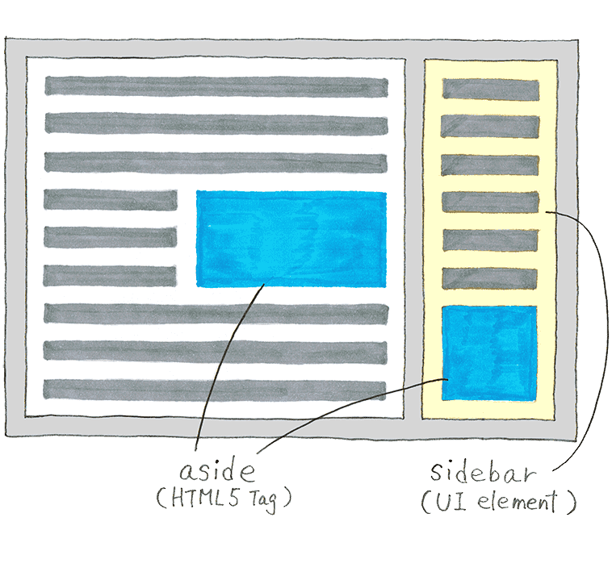

# DisableScoreboardSidebar
```
This is a very simple minecraft mod that allows the client to disable a server's scorebaord sidebar,
if they so choose.
```
**Minecraft Version**: ``1.16.5``

Tested Forge Version: ``36.1.0``
## Commands

```
Command Prefix: $
```

- ``disableSidebar``: disables the scoreboard sidebar. 
- ``enableSidebar``: re-enables the scoreboard sidebar.

## Definition of Sidebar
A sidebar is, by definition:
```
a narrow vertical area that is located alongside the main display area, typically containing 
related information or navigation options

    - Oxford University Press
```


[Image Source](https://aastudio.fr/Sidebar-and-Aside-are-different.html)